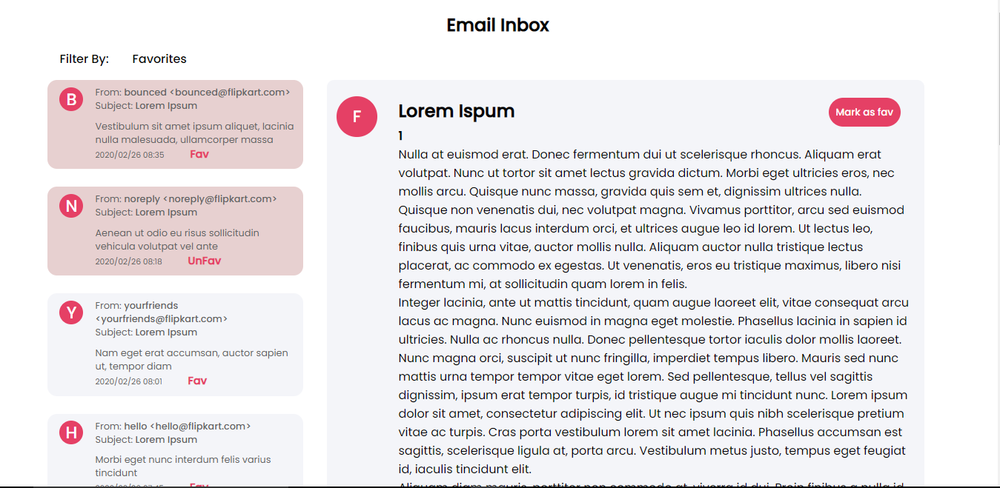
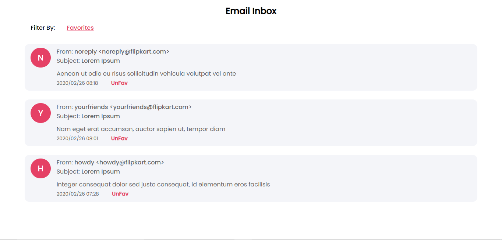

# Email Dashboard Application

## Tech Stack -

- FrontEnd - ReactJs
- State management - Redux toolkit
- Styling - CSS

## Core features -

- Fetch all emails list
- Get email body for a particular email

- Mark an email as favourite (data persists accross sessions), separate fav list section.
- Differentiate read and unread emails by using CSS.

